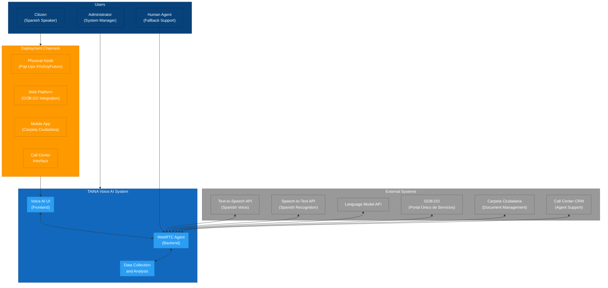

# 2.1 Context Diagram

## Overview

This document presents the Context diagram for the TAINA Voice AI system, following the C4 model for visualizing software architecture. The Context diagram provides a high-level view of the system and its interactions with users and external systems.

## Diagram

## Components

### Users

1. **Citizen (Spanish Speaker)**
   - Regular citizen seeking government services
   - Interacts with TAINA to access government services and information
   - Communicates in Spanish

2. **Administrator (System Manager)**
   - Technical staff responsible for system management
   - Configures and monitors the TAINA system
   - Manages knowledge base and system settings

3. **Human Agent (Fallback Support)**
   - Human agent who provides support for complex cases
   - Receives escalations from the AI system
   - Provides specialized assistance to citizens

### TAINA Voice AI System

1. **Voice AI UI (Frontend)**
   - Web-based user interface
   - Provides conversational interface in Spanish
   - Captures audio input and plays audio output
   - Displays conversation transcripts and service information

2. **WebRTC Agent (Backend)**
   - Processes audio and manages conversations
   - Integrates with external APIs for speech and language processing
   - Retrieves information from knowledge base
   - Handles business logic and function execution

3. **Data Collection and Analysis**
   - Collects and analyzes interaction data
   - Identifies patterns and trends in citizen needs
   - Generates insights for service improvement
   - Provides data-driven recommendations

### External Systems

1. **Text-to-Speech API (Spanish Voice)**
   - Converts text to natural-sounding Spanish speech
   - Supports Dominican Spanish accent
   - Provides voice output for the conversation

2. **Speech-to-Text API (Spanish Recognition)**
   - Converts Spanish speech to text
   - Handles various Spanish dialects and accents
   - Provides real-time transcription

3. **Language Model API**
   - Processes natural language understanding and generation
   - Handles conversation context and intent recognition
   - Generates appropriate responses based on citizen queries

4. **GOB.DO (Portal Único de Servicios)**
   - Government service portal
   - Provides information about government services
   - Offers service registration and tracking

5. **Carpeta Ciudadana (Document Management)**
   - Citizen document management system
   - Stores and retrieves citizen documents
   - Provides secure document access

6. **Call Center CRM (Agent Support)**
   - Call center customer relationship management system
   - Manages call center agent assignments
   - Tracks citizen interactions and case history

### Deployment Channels

1. **Physical Kiosk (Pop-Ups #YoSoyFuturo)**
   - Physical installation in government offices and public spaces
   - Provides touchscreen and voice interface
   - Offers direct access to TAINA in public locations

2. **Web Platform (GOB.DO Integration)**
   - Integration with government web portal
   - Provides browser-based access to TAINA
   - Offers seamless experience with existing government services

3. **Mobile App (Carpeta Ciudadana)**
   - Integration with government mobile application
   - Provides on-the-go access to TAINA
   - Offers mobile-optimized interface

4. **Call Center Interface**
   - Integration with call center systems
   - Provides agent assistance interface
   - Offers human-in-the-loop support

## Key Insights

1. **Multi-Channel Deployment**
   - TAINA is designed for deployment across multiple channels
   - Consistent experience across physical kiosks, web, mobile, and call centers
   - Adapts to different interaction contexts and device capabilities

2. **Government Service Integration**
   - Deep integration with existing government systems
   - Seamless access to government service information
   - Secure document retrieval and submission

3. **Data-Driven Insights**
   - Collection and analysis of citizen interaction data
   - Pattern recognition for service improvement
   - Continuous learning and optimization

4. **Human-AI Collaboration**
   - Seamless escalation to human agents when needed
   - Context preservation during handoffs
   - Augmentation of human agent capabilities

5. **Accessibility and Inclusion**
   - Spanish-first design for Dominican citizens
   - Support for various Spanish dialects and accents
   - Multiple access points to ensure broad accessibility
